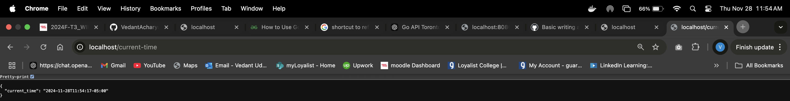

### In this assignment, you will develop an API using the Go programming language. This API will provide the current time in Toronto in JSON format. Additionally, each request to the API will log the current time to a MySQL database.

#####  Setup database: 
```
create database week13Lab;
use week13Lab;
create table time_log(id INT AUTO_INCREMENT PRIMARY KEY,timestamp DATETIME NOT NULL);
```
#####  Install MySQL driver:
```
go get -u github.com/go-sql-driver/mysql
```
#####  create web server (main.go):
```
package main

import (
	"database/sql"
	"encoding/json"
	"fmt"
	"log"
	"net/http"
	"time"

	_ "github.com/go-sql-driver/mysql"
)

var db *sql.DB

type TimeResponse struct {
	CurrentTime string `json:"current_time"`
}

func initDB() error {
	var err error
	db, err = sql.Open("mysql", "root:12345678@tcp(0.0.0.0:3306)/week13Lab")
	if err != nil {
		return err
	}
	return db.Ping()
}

// Get current time in Toronto timezone
func getCurrentTorontoTime() (time.Time, error) {
	location, err := time.LoadLocation("America/Toronto")
	if err != nil {
		return time.Time{}, err
	}
	return time.Now().In(location), nil
}

// API handler for /current-time
func currentTimeHandler(w http.ResponseWriter, r *http.Request) {
	// Get Toronto time
	torontoTime, err := getCurrentTorontoTime()
	if err != nil {
		http.Error(w, "Error getting Toronto time", http.StatusInternalServerError)
		log.Printf("Timezone error: %v", err)
		return
	}

	// Insert time into MySQL
	_, err = db.Exec("INSERT INTO time_log (timestamp) VALUES (?)", torontoTime)
	if err != nil {
		http.Error(w, "Error logging time to database", http.StatusInternalServerError)
		log.Printf("Database error: %v", err)
		return
	}

	// Respond with JSON
	response := TimeResponse{CurrentTime: torontoTime.Format(time.RFC3339)}
	w.Header().Set("Content-Type", "application/json")
	json.NewEncoder(w).Encode(response)
}

func main() {
	// Initialize database
	if err := initDB(); err != nil {
		log.Fatalf("Failed to connect to database: %v", err)
	}
	defer db.Close()

	// Set up HTTP server
	http.HandleFunc("/current-time", currentTimeHandler)
	fmt.Println("Server is running on http://localhost:8080")
	log.Fatal(http.ListenAndServe(":8080", nil))
}
```
#####  How it works:
###### Database Setup:

- A MySQL database is set up with a table ```time_log``` to store the timestamps of API requests.
###### API Endpoint:

- The ```/current-time``` endpoint is served by ```currentTimeHandler```.

###### Time Zone Conversion:

- ```time.LoadLocation``` is used to get the ```America/Toronto``` timezone.
###### Database Connection:

- The ```database/sql``` package connects to MySQL.
On every request, the current Toronto time is logged in the time_log table.
###### JSON Response:

- The ```TimeResponse``` struct is serialized into JSON and returned to the client.
###### Error Handling:

- Errors in time conversion or database operations are logged and returned as HTTP 500 errors.
#####  Run the Application:
- Ensure MySQL is running and the database is set up.
- Update the database connection credentials in the code.
- Run the Go application:
```
go run main.go
```
- Access the API:
```
http://localhost:8080/current-time
```
##### sample JSON Response
```
{
    "current_time": "2024-11-28T10:45:32-05:00"
}
```

##### dockerize the application
```
FROM golang:1.23 AS builder
WORKDIR /app
COPY  go.mod go.sum ./ 
RUN go mod download 
COPY  . .
RUN CSG_ENABLED=0 GOOS=linux GOARCH=amd64 go build -o app .
FROM alpine:3.20
WORKDIR /root/
COPY --from=builder  /app/app ./app
COPY --from=builder  /app/templates ./templates
EXPOSE 80
CMD [ "./app" ]
```
##### Run this command to build and run commands
```
docker build -t dweek13:0.1 .     

docker run -p 80:80 dweek13:0.1   
```

Screen shot of the output


